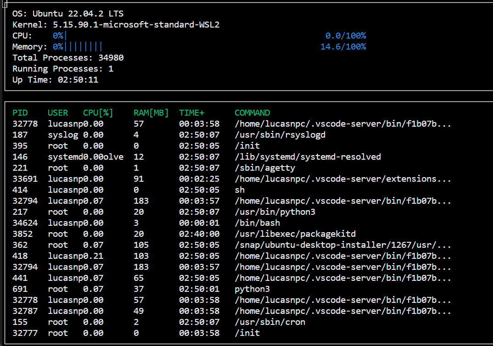

# About the System Monitor Project

This project is part of the [Udacity C++ Nanodegree Program](https://www.udacity.com/course/c-plus-plus-nanodegree--nd213). To succeed in this project you must satisfy the following requirements:
* Basic Requirements
  * The program must build without generating compiler warnings.
  * The program must build an executable system monitor.
  * The system monitor must run continuously without error, until the user terminates the program.
  * The project should be organized into appropriate classes.
* System Requirements
  * The system monitor program should list at least the operating system, kernel version, memory utilization, total number of processes, number of running processes, and uptime.
  * The System class should be composed of at least one other class.
* Processor Requirements
  * The system monitor should display the CPU utilization.
* Process Requirements
  * The system monitor should display a partial list of processes running on the system.
  * The system monitor should display the PID, user, CPU utilization, memory utilization, uptime, and command for each process.

## ncurses
[ncurses](https://www.gnu.org/software/ncurses/) is a library that facilitates text-based graphical output in the terminal. This project relies on ncurses for display output.

To install ncurses within your own Linux environment: `sudo apt install libncurses5-dev libncursesw5-dev`

## Make
This project uses [Make](https://www.gnu.org/software/make/). The Makefile has four targets:
* `build` compiles the source code and generates an executable
* `format` applies [ClangFormat](https://clang.llvm.org/docs/ClangFormat.html) to style the source code
* `debug` compiles the source code and generates an executable, including debugging symbols
* `clean` deletes the `build/` directory, including all of the build artifacts

## Instructions

1. Clone the project repository: `git clone https://github.com/lucasnpc/Cpp-System-Monitor.git`

2. Build the project: `make build`

3. Run the resulting executable: `./build/monitor`

4. Follow along with the lesson.

5. Implement the `System`, `Process`, and `Processor` classes, as well as functions within the `LinuxParser` namespace.

6. That's it!
